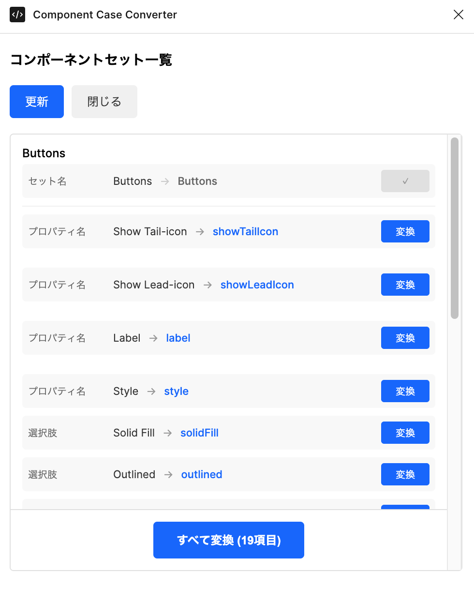

# Component Case Converter

Figma のコンポーネントセットとバリアントプロパティの命名規則を簡単に変換できるプラグインです。

## 機能

- **コンポーネントセット名の変換**: コンポーネントセット名を PascalCase に自動変換
- **プロパティ名の変換**: バリアントプロパティ名を camelCase に変換
- **プロパティ値の変換**: バリアントの選択肢の値を camelCase に変換
- **複数プロパティタイプに対応**: VARIANT、BOOLEAN、TEXT、INSTANCE_SWAP プロパティをサポート
- **リアルタイム更新**: ページ内のコンポーネント変更を自動検知して一覧を更新
- **選択機能**: クリックでコンポーネントをFigma上で選択可能

## スクリーンショット



## 使い方

1. Figma でプラグインを起動
2. 現在のページにあるコンポーネントセット一覧が表示されます
3. 変換後の名前を確認し、「すべて変換」ボタンで一括変換
4. 個別に変更したい場合は、表示されている変換後の名前を確認して「変換」ボタンで個別変換

## 開発環境のセットアップ

### 必要なもの

- Node.js と npm
- Visual Studio Code（推奨）

### セットアップ手順

1. Node.js をインストール:
   - https://nodejs.org/en/download/

2. 依存関係をインストール:
   ```bash
   npm ci
   ```

### 開発方法

1. Visual Studio Code でこのディレクトリを開く
2. ビルドタスクを実行: `Terminal > Run Build Task...` から `npm: watch` を選択
3. TypeScript のコードを編集すると、自動的に JavaScript にコンパイルされます

### ファイル構成

- `code.ts`: プラグインのメインロジック
- `ui.html`: プラグインの UI
- `manifest.json`: プラグインの設定ファイル

## 技術詳細

このプラグインは TypeScript で記述されており、以下の機能を実装しています:

- コンポーネントセットとそのプロパティの自動検出
- ケース変換ロジック（camelCase / PascalCase）
- Figma Document Change API によるリアルタイム監視
- コンポーネントプロパティの一括編集
